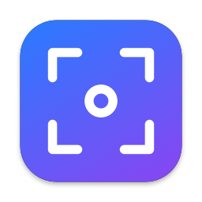
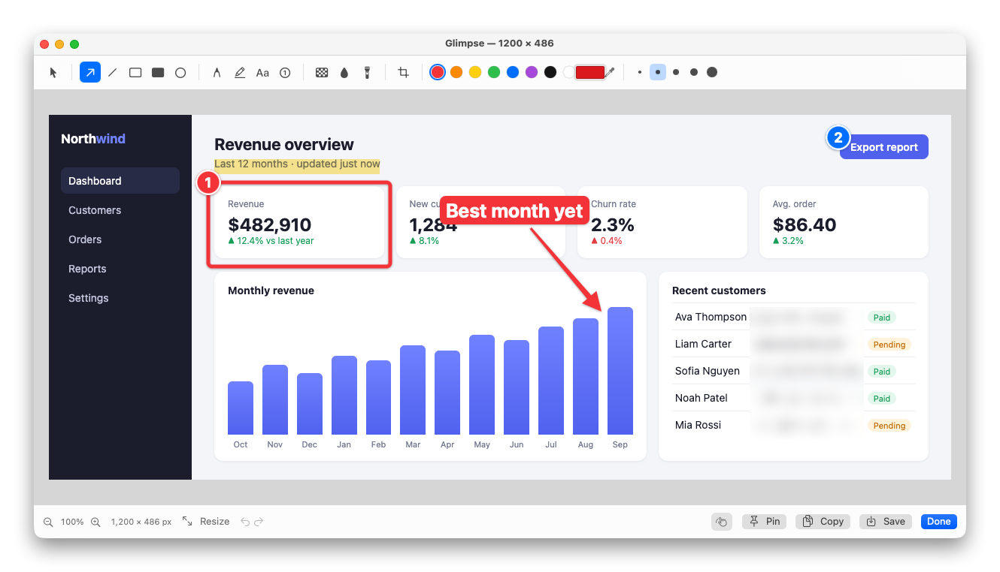
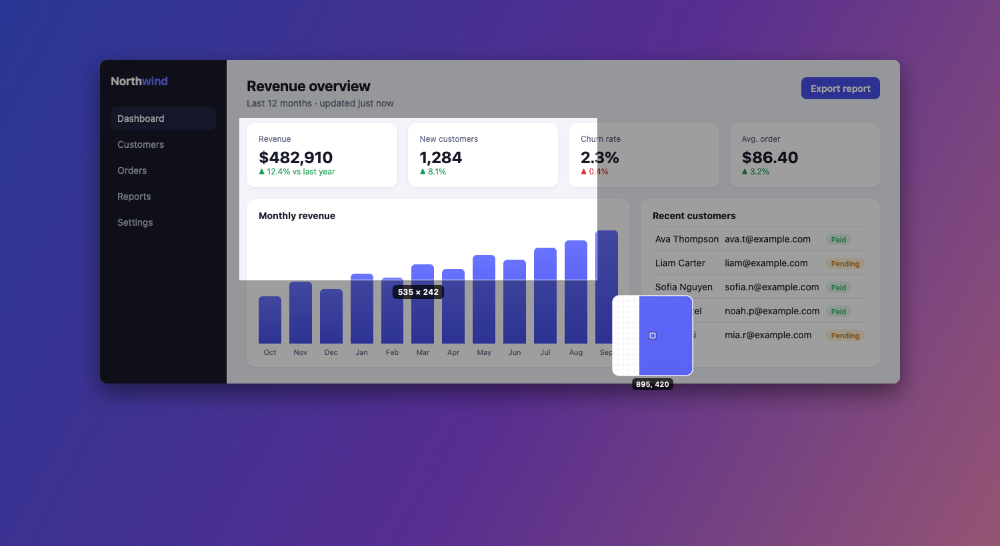
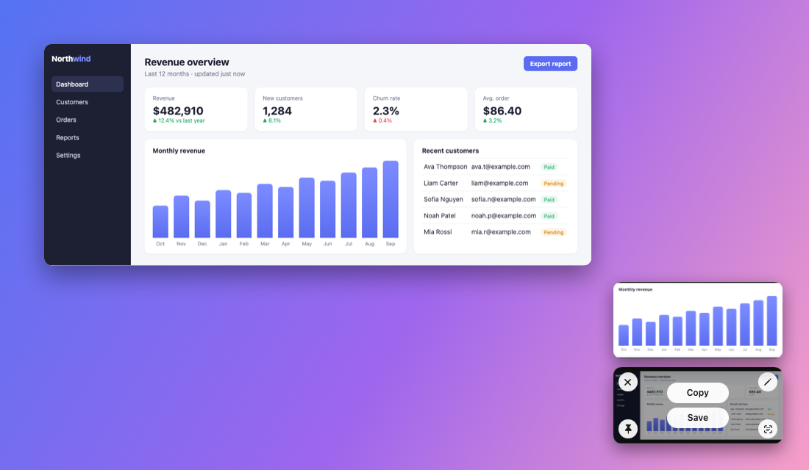
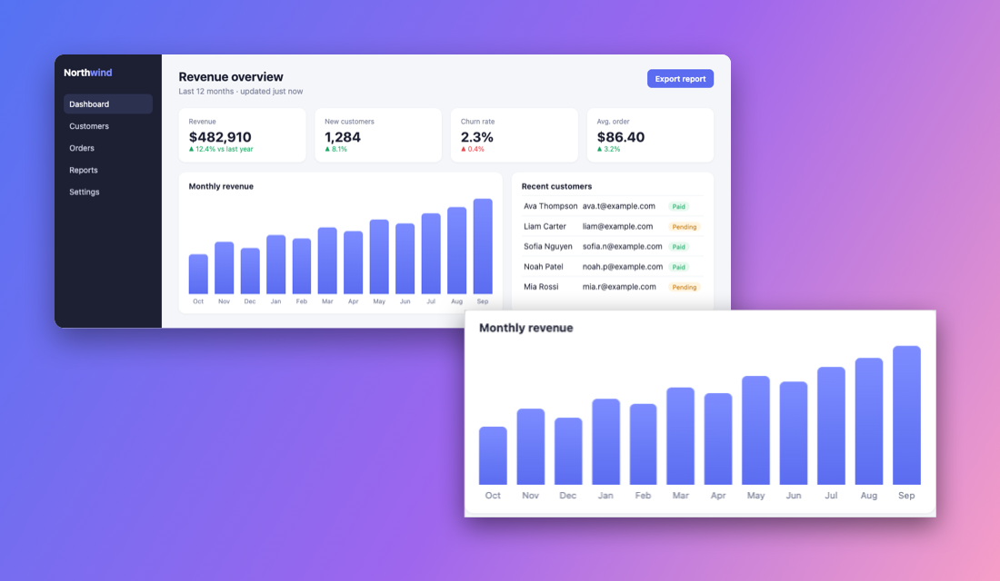
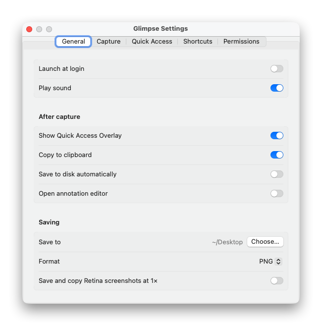

<p align="center">
  
</p>

<h1 align="center">Glimpse</h1>

<p align="center">
  A fast, native macOS screenshot tool that lives in your menu bar.<br>
  Capture an area, a window, a whole page. Annotate it, redact it, pin it, drag it anywhere.
</p>

<p align="center">
  
  
  
  <a href="LICENSE"></a>
</p>



## Features

### Capture

- **Area** on a frozen screen, with crosshair, pixel magnifier and live size. `Space` switches to window mode.
- **Window** as a clean cut-out with transparent corners and an optional soft shadow.
- **Fullscreen**, **previous area**, and a **self-timer** (3, 5 or 10 seconds).
- **Scrolling capture** of long pages, chats and documents. Scroll yourself or let auto-scroll do it;
  sticky headers and footers appear once.
- **Capture text (OCR)** copies the text in any area, and reads QR codes. Runs on-device.



### Quick Access Overlay

Every capture slides into a corner of the screen. Hover it for **Copy** and **Save**, or use the corner
buttons to close, annotate, pin or copy its text. Drag it straight into Slack, Mail, Finder or any other
app. Swipe it away, or bring back the last one you closed.



### Annotate

Arrow, line, rectangle, filled rectangle, ellipse, pen, highlighter, text (plain, outline or background),
numbered steps, **pixelate** and **blur** for redaction, spotlight, crop and resize. Every annotation stays
editable: select, move, resize, restyle or delete it. Colour presets, a custom colour, an eyedropper,
undo/redo and zoom. Each tool has a single-key shortcut.

### Pin

Keep a screenshot floating above every window while you work. Resize it, fade it, nudge it with the arrow
keys, or lock it so clicks pass through.



### And

- Every shortcut is configurable, and captures can be scripted with `glimpse://` URLs.
- AI agents (Claude Code, Claude Desktop, Cursor, …) can take screenshots and read text through Glimpse's
  [MCP server](#ai-agents-mcp).
- Settings for what happens after a capture (overlay, clipboard, auto-save, open editor), save folder,
  PNG or JPEG, overlay position and size, and launch at login.

<p align="center">
  
</p>

## Install

Run this in Terminal:

```sh
curl -fsSL https://raw.githubusercontent.com/miladbeigi/glimpse/master/install.sh | bash
```

It downloads the latest release, checks its SHA-256, installs **Glimpse.app** to `/Applications` (or
`~/Applications` if that isn't writable), and launches it. Read [`install.sh`](install.sh) first if you like;
it's short. Running it again updates or reinstalls. After that, Glimpse keeps itself up to date (see
[Updates](#updates)).

<details>
<summary>Manual install</summary>

1. Download `Glimpse-<version>.zip` from the [latest release](../../releases/latest) and unzip it.
2. Move **Glimpse.app** to `/Applications`.
3. The app isn't notarized by Apple, so macOS blocks the first launch. Double-click the app, click **Done**
   (not Move to Trash), then open **System Settings → Privacy & Security**, scroll down and click
   **Open Anyway**. Or skip the warning by running:

   ```sh
   xattr -dr com.apple.quarantine /Applications/Glimpse.app
   ```

</details>

### Permissions

On first launch a setup window walks you through them:

- **Screen Recording** (required): turn on Glimpse in **System Settings → Privacy & Security → Screen &
  System Audio Recording**, then click **Relaunch Glimpse**.
- **Accessibility** (optional): only used by auto-scroll in Scrolling Capture.

Release builds are ad-hoc signed, so after updating you may need to switch Glimpse off and on again in the
Screen Recording list.

### Updates

At launch and every 6 hours, Glimpse checks this repository's latest GitHub release. When a newer version is
out, **Update to Glimpse X.Y.Z** shows up at the top of the menu bar menu and in **Settings → General →
Updates**, which also has **Check Now** and a switch to turn automatic checks off. Updating downloads the zip,
checks its SHA-256 against the `.sha256` file published with the release, swaps the app in place and
relaunches.

The checksum confirms the download isn't corrupted; it isn't a signature. Anyone who can publish releases to
this repository can ship an update.

## Shortcuts

| Action | Default |
|---|---|
| Capture Area | ⌥⇧⌘4 |
| Capture Fullscreen | ⌥⇧⌘3 |
| Capture Window | ⌥⇧⌘5 |
| Scrolling Capture | ⌥⇧⌘6 |
| Capture Previous Area | ⌥⇧⌘7 |
| Self-Timer | ⌥⇧⌘8 |
| Capture Text | ⌥⇧⌘2 |
| Restore Recently Closed | ⌥⇧⌘9 |

The defaults stay clear of macOS's own ⇧⌘3/4/5. To use those instead, turn off the system screenshot
shortcuts in **System Settings → Keyboard → Keyboard Shortcuts → Screenshots**, then set them in
Glimpse's Settings.

**In the editor:** V select · A arrow · L line · R rectangle · F filled rectangle · O ellipse · P pen ·
H highlighter · T text · N counter · X pixelate · B blur · S spotlight · C crop.
Hold ⇧ to snap angles and squares. ⌫ deletes, arrow keys nudge, ⌘D duplicates, ⌘Z / ⇧⌘Z undo and redo,
⌘C copy, ⌘S save, ⇧⌘S save as, ⌘P pin, ⌘0 zoom to fit.

## Automation

Every capture mode can be triggered with a URL, from scripts, Shortcuts, Raycast or Alfred:

```sh
open "glimpse://capture-area"                                   # interactive
open "glimpse://capture-area?x=100&y=80&width=800&height=400"   # points from the top-left of the display
open "glimpse://capture-fullscreen?delay=3"
open "glimpse://capture-window"
open "glimpse://scrolling-capture?x=0&y=120&width=1200&height=900&autoscroll=1"
open "glimpse://self-timer?x=200&y=150&width=1000&height=600&delay=5"
open "glimpse://capture-text?x=0&y=0&width=1200&height=300"
open "glimpse://annotate?filepath=/path/to/image.png"
```

Also `capture-previous-area`, `restore-recently-closed`, `annotate-clipboard`, `pin-clipboard`,
`pin?filepath=…`, `open-settings` (optionally `?tab=shortcuts`) and `permissions`. Region commands accept `display=N` (1-based).

## AI agents (MCP)

Glimpse includes an [MCP](https://modelcontextprotocol.io) server, so coding agents and other AI tools can see
your screen. Turn on **Settings › Agents › Allow AI agents to take screenshots**, then connect your agent:

```sh
claude mcp add glimpse -- /Applications/Glimpse.app/Contents/MacOS/Glimpse mcp
```

Other clients take the same command in their MCP config:

```json
{ "mcpServers": { "glimpse": { "command": "/Applications/Glimpse.app/Contents/MacOS/Glimpse", "args": ["mcp"] } } }
```

| Tool | What it does |
|---|---|
| `list_windows` | On-screen windows front to back: id, app, bundle id, title, bounds |
| `list_displays` | Displays with frame and scale |
| `screenshot_window` | One window by `window_id`, or `app` and/or `title`, even when it's covered |
| `screenshot_screen` | A whole display |
| `screenshot_region` | A rectangle, in the same screen coordinates as `list_windows` |
| `read_text` | On-device OCR (and QR codes) of a window, region or display |

Screenshots come back inline, scaled to `max_size` (1568 px on the long edge by default, `0` for full size), and
are also saved at full resolution (`save_path`, or a temporary folder); the result includes the file path and the
captured frame for mapping pixels to screen points. `format: "jpeg"` makes them smaller and `include_image: false`
returns only the path.

`Glimpse mcp` does no capturing itself: it forwards calls to the Glimpse app (launching it if needed) over a
socket only your user can open, so captures use Glimpse's Screen Recording permission, not your terminal's.

## Build from source

Requires Xcode 15.3 or later (or a Swift 5.10+ toolchain) and macOS 14.

```sh
git clone https://github.com/miladbeigi/glimpse.git
cd glimpse
scripts/build.sh --install   # builds build/Glimpse.app, copies it to /Applications and launches it
```

Other options:

```sh
swift test                   # unit tests
scripts/build.sh             # build only (universal)
scripts/build.sh --zip       # also write build/Glimpse-<version>.zip and .sha256
scripts/build.sh --debug     # debug build in build/debug/Glimpse.app
```

macOS ties the Screen Recording permission to the app's signature, so ad-hoc builds lose it on every rebuild.
For development, create a local signing identity once with `scripts/setup-signing.sh` (it lives in its own
keychain under `~/Library/Application Support/Glimpse-dev/`); `build.sh` then uses it automatically. You can
also set `GLIMPSE_SIGN_IDENTITY` to any signing identity.

## Development

- Code is in `Sources/Glimpse` (the editor in `Sources/Glimpse/Editor`), tests in `Tests/GlimpseTests`.
  [`SPEC.md`](SPEC.md) describes the features and architecture.
- `scripts/smoke-test.sh` drives real captures against the installed app through URL commands. Test settings
  are passed as launch arguments, so your saved preferences are never touched.
- The app icon is generated by `swift scripts/make-icon.swift`.
- The screenshots in `docs/` are rendered by the app itself from a sample image (debug builds only):

  ```sh
  scripts/build.sh --debug
  open -n build/debug/Glimpse.app --env GLIMPSE_DOCS_DIR="$PWD/docs" --env GLIMPSE_DOCS_SAMPLE=/path/to/sample.png
  ```

## Releasing

```sh
scripts/release.sh patch        # or minor, major, or an exact version like 1.2.0
```

It checks that you're on an up-to-date, clean `master`, writes `VERSION`, commits, tags `v<version>` and pushes.
The **Release** workflow then runs the tests, builds a universal app and publishes `Glimpse-<version>.zip` and
its `.sha256` to a GitHub release. `install.sh` and the in-app updater both pick it up from there. Follow the
build with `gh run watch`.

The **CI** workflow runs the tests and builds the app on every push to `master` and every pull request.

## License

[MIT](LICENSE)
